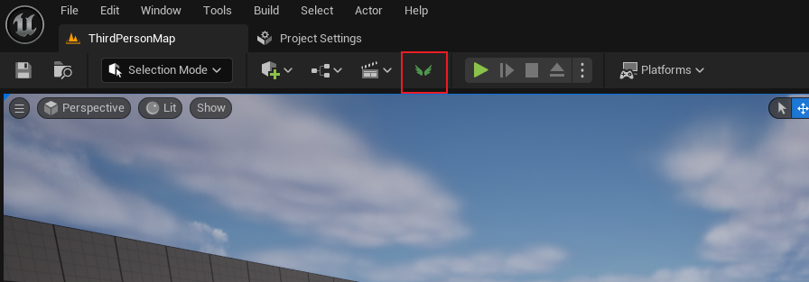

# FastInput插件

## 介绍

这是一个可以让设计师定制任何输入界面选项的插件。  
此插件会检测焦点所在的小部件，并递归查找其父小部件。当找到SDetailSingleItemRow时，插件会检查属性句柄并提供设计者之前设置的选项。  

## 优势
当设计师需要在细节面板，数据表等处设置大量配置时，这类插件效果显著。  
此插件比使用DetailCustomizetion更方便，因为使用DetailCustomizetion需要程序员为需要选项的每个属性编写结构。

## 注意
该插件需要在引擎中公开一个变量和一个函数。

## 使用方法

1. 插件的按钮位于工具栏上。点击后，它将显示该插件的编辑器用户小部件。您可以将其悬挂在编辑器的任何您喜欢的位置。

2. 为了为输入界面创建选项，您需要创建一个DT表。不限制DT表的结构体。不限制DT表的位置。

3. 点击要创建选项的输入界面，使其被选中。

4. 复制数据表的引用并将其粘贴在Fast Input编辑器用户小部件中。
5. 输入选项的列名。比如rowname。不限制大小写。

6. 点击Fast Input编辑器用户小部件上的<确认修改>。

7. 配置将作为一个json存储在路径：/Content/FastInput。

8. 选项将在编辑器用户小部件中显示，当你点击它时，内容会被写入到界面中。

# FastInput Plugin

## Introduction

This is a plugin that allows designers to customize any input interface options.
The plugin will detect the widget where the focus is located and recursively find its parent widgets. When SDetailSingleItemRow is found, the plugin will inspect the property handle and provide the options previously set by the designer.

## Advantages

When designers need to set a large number of configurations in detail panels, data tables, etc., such plugins are significantly effective.
This plugin is more convenient than using DetailCustomizetion because using DetailCustomizetion requires programmers to write structures for each attribute that needs options.

## Note
This plugin needs to expose a variable and a function in the engine. 

## How to Use

1. The button of the plugin is located on the toolbar. After clicking, it will display the editor user widget of this plugin. You can hang it anywhere in the editor you like.

2. In order to create options for the input interface, you need to create a DT table. The structure of the DT table is not limited. The location of the DT table is not limited.

3. Click the input interface you want to create options for to select it.

4. Copy the reference of the data table and paste it into the Fast Input editor user widget.
5. Enter the column name of the option, such as rowname. It is not case sensitive.

6. Click <Confirm Modification> on the Fast Input editor user widget.

7. The configuration will be stored as a JSON at the path: /Content/FastInput.

8. The options will be displayed in the editor user widget. When you click on it, the content will be written into the interface.
